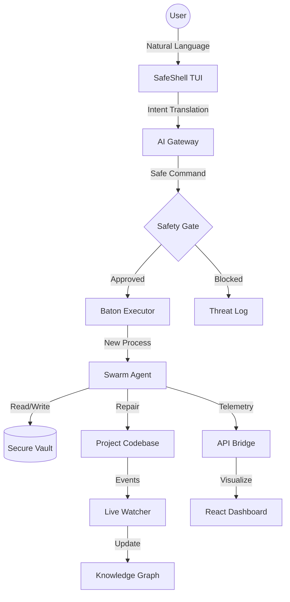

# 🏗️ Architecture Flow

### Flow Breakdown:
1.  **Intent Layer**: User provides natural language.
2.  **Safety Layer**: The command is stripped to its root binary and checked against the Risk DB.
3.  **Execution Layer**: A new OS process is spawned to ensure total memory isolation.
4.  **Feedback Layer**: Results are piped back to the Dashboard and Knowledge Graph simultaneously.
