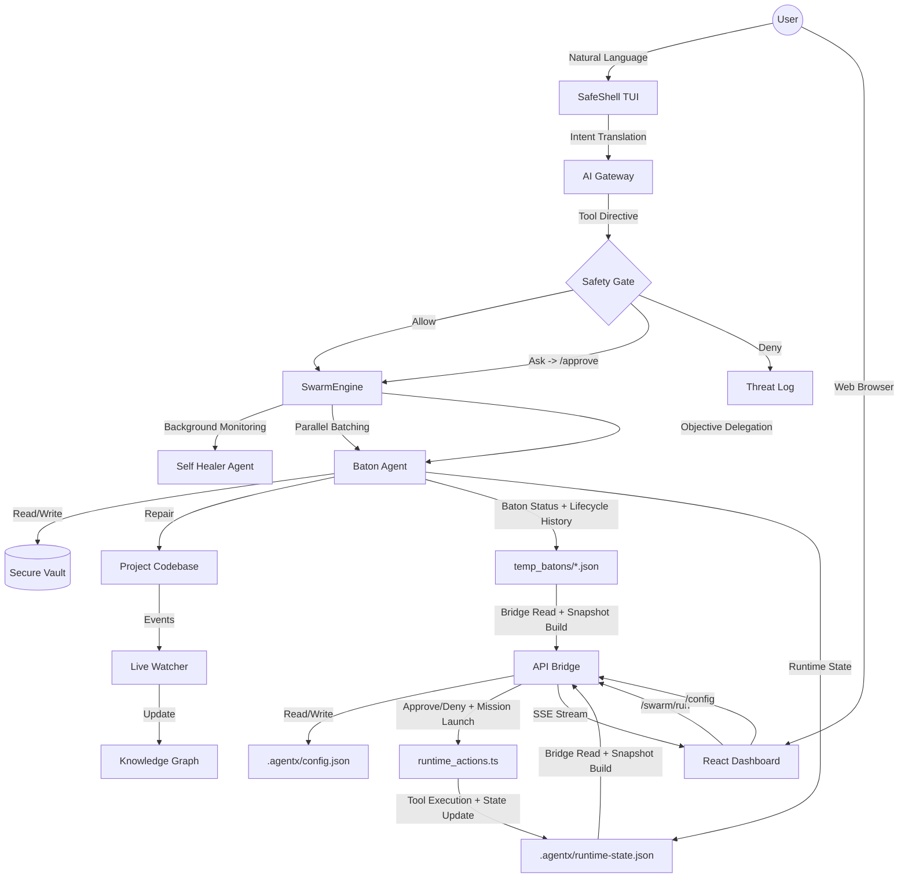

# 🏗️ Architecture Flow



## Unified CLI

```
agentx              → Start the interactive SafeShell TUI (default)
agentx dash         → Launch Dashboard + API Bridge in one command
agentx run [--bg]   → Delegate a mission to SwarmEngine (optionally in background)
agentx status       → Show swarm health & active batons
agentx setup        → Configure AI provider, API key & model interactively
agentx doctor       → Run system health checks and diagnostics
agentx memory       → Manage agent persistent memory
agentx help         → Show available commands
```

## Configuration

API settings are stored in `.agentx/config.json` and can be configured two ways:
- **CLI**: Run `agentx setup` for an interactive wizard
- **Dashboard**: Click the Settings (gear) icon in the sidebar

Both read from and write to the same config file. Gateway clients (TypeScript and Python) 
read config.json first, falling back to environment variables if the config is missing.

### Flow Breakdown:
1.  **Intent Layer**: User provides natural language via TUI or the Dashboard's "Run Mission" input.
2.  **Safety Layer**: The command is stripped to its root binary by `CommandStripper`, checked for dangerous patterns, and classified as **Allow / Ask / Deny**.
3.  **Approval Layer**: Risky commands pause until the user approves or denies them. Dashboard approvals require Bearer Token authorization to prevent CSRF.
4.  **Execution Layer**: The unified `SwarmEngine` handles task execution, supporting background healing, parallel processing, and objective-based baton handoffs.
5.  **Feedback Layer**: Runtime events, pending approvals, and baton task state are persisted into shared state files, then surfaced through the `API Bridge` as live SSE snapshots for the Dashboard.
