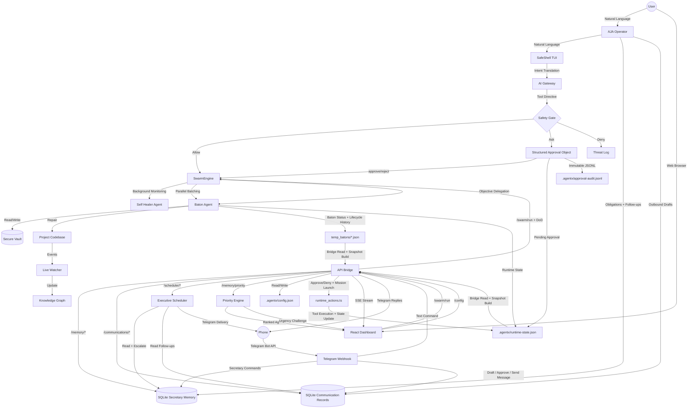

# Architecture Flow



## Naming Model

- **AgentX Core** is the engine: runtime state, tools, safety gates, dashboard bridge, vault, and swarm orchestration.
- **AJA** is the operator: the assistant personality that receives intent, explains consequences, and routes work through AgentX Core.
- Practical shorthand: **AgentX Core powers AJA**.

## Unified CLI

```
agentx              → Start the interactive SafeShell TUI (default)
agentx dash         → Launch Dashboard + API Bridge in one command
agentx run [--bg]   → Delegate a mission to SwarmEngine (optionally in background)
agentx status       → Show swarm health & active batons
agentx setup        → Configure AI provider, API key & model interactively
agentx doctor       → Run system health checks and diagnostics
agentx memory       → Manage agent persistent memory
agentx help         → Show available commands
```

## Configuration

API settings are stored in `.agentx/config.json` and can be configured two ways:
- **CLI**: Run `agentx setup` for an interactive wizard
- **Dashboard**: Click the Settings (gear) icon in the sidebar

Both read from and write to the same config file. Gateway clients (TypeScript and Python) 
read config.json first, falling back to environment variables if the config is missing.

### Flow Breakdown:
1.  **Intent Layer**: User provides natural language via AJA, SafeShell TUI, Telegram, or the Dashboard's "Run Mission" input.
2.  **Priority Layer**: Intent is passed through the **Priority Engine**, which ranks tasks by urgency and stake, challenging false urgency before the user commits.
3.  **Safety Layer**: The command is stripped to its root binary by `CommandStripper`, checked for dangerous patterns, and classified as **Allow / Ask / Deny**.
4.  **Approval Layer**: Risky commands pause as structured approval objects. The user sees the request ID, command preview, action type, human-readable reason, risk level, rollback path, expiration timestamp, requester source, and dry-run summary before approving or rejecting.
5.  **Execution Layer**: The unified `SwarmEngine` handles task execution, supporting background healing, parallel processing, and objective-based baton handoffs. Every delegation mission is constrained by a mandatory **Definition of Done (DoD)** checklist.
6.  **Feedback Layer**: Runtime events, pending approvals, approval audit records, Telegram command history, and baton task state are persisted into shared state files, then surfaced through the `API Bridge` as live SSE snapshots for the Dashboard and concise Telegram replies.

## Phase 1: Telegram Remote Control

The Telegram Bot API connects to `POST /telegram/webhook` on the FastAPI bridge. The bridge whitelists `TELEGRAM_ALLOWED_USER_ID`, accepts text commands only, maps supported intents to known actions, and logs command history to `.agentx/telegram-history.jsonl`.

## Phase 2: Production Approval Workflow

Risky Telegram commands are written into `.agentx/runtime-state.json` so the dashboard queue sees the same approval object as the phone.

All approvals expire and are re-checked through `FileGuardian` and `CommandStripper` before execution.

## Phase 3: Structured Secretary Memory

AJA stores obligations in SQLite at `.agentx/aja_secretary.sqlite3`, separate from transient runtime state. This memory tracks obligations, follow-ups, recurring responsibilities, reminders, escalation level, communication history, and source.

## Phase 4: Messaging Layer

AJA stores outbound communication in `secretary_communications` inside `.agentx/aja_secretary.sqlite3`.

Every outbound message starts as an approval-required draft. The direct send path is only implemented for Telegram, and it still refuses to send until approval is recorded.

## Phase 5: Scheduler and Executive Review

The executive scheduler reads tasks and communications from SQLite, generates high-signal reviews, and records delivery events to prevent spam.

Supported reviews: Morning, Night, and Weekly.

## Phase 6: Priority Engine & Definition of Done (DoD)

The **Priority Engine** computes a 0-100 score for every task using urgency, stakeholder weight, and consequence. It surfaces a "Top 3" agenda on the dashboard and challenges the user with "Urgency Challenges."

The **Definition of Done (DoD)** framework enforces mandatory success criteria for every delegated mission. Criteria are auto-generated from keywords (e.g., "code", "auth", "deploy") if not manually specified, ensuring worker agents remain aligned with executive expectations.
