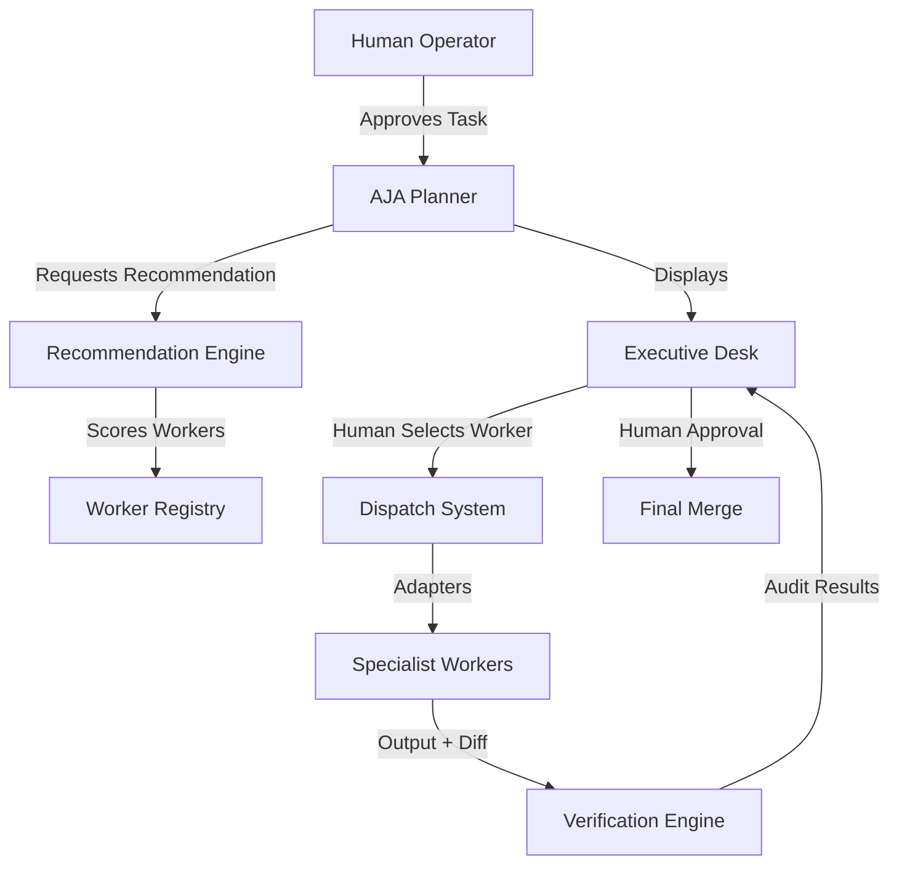

# Phase 6 — Controlled Execution & Independent Verification

## Status: COMPLETE

## Summary

AJA now supports a mature "Controlled Execution Operator" workflow. Instead of blindly trusting worker-reported success, AJA uses a multi-stage delegation process that includes automated recommendation, worker dispatch, and independent outcome verification.

---

## Architecture

## Key Components

1.  **Worker Capability Registry:** Persistent SQLite profiles for specialist agents (Copilot, Gemini, Aider, etc.).
2.  **Recommendation Engine:** An 8-dimension scoring system that selects the best agent for a specific task based on reliability, speed, and cost.
3.  **Dispatch Adapters (`scripts/dispatch_adapters.py`):** Modular drivers that handle the unique CLI patterns of different agents.
4.  **Verification Engine (`scripts/verification_engine.py`):** An independent auditor that vetting worker output before human review.

---

## PART A — Worker Registry & Recommendation

AJA manages a registry of specialist workers and provides ranked recommendations for every mission.

### Recommendation Dimensions:
*   Task Type Match
*   Capability Requirements (Tests/Git/Deploy)
*   Historical Reliability
*   Execution Speed
*   Cost Profile (Free/Subscription/Pay-per-use)
*   Risk Alignment

---

## PART B — Independent Verification Engine

AJA no longer trusts self-reported worker success. Every completed mission is audited by the **Verification Engine**.

### Automated Checks:
1.  **Test Integrity:** Verifies that tests were executed and that no "failed" or "error" strings exist in the captured `tests_output`.
2.  **Branch Isolation:** Ensures work was isolated on a feature branch (checks `git branch --show-current`).
3.  **Secret Leakage:** Runs heuristic regex sweeps for API keys (OpenAI, AWS, GitHub) accidentally committed in the diff.
4.  **DoD Satisfaction:** Confirms the worker returned a valid Definition of Done checklist.
5.  **Diff Presence:** Ensures the worker actually modified the expected files.

### Dashboard Guardrails:
*   **Merge Block:** The "Approve Merge" button is disabled if verification fails.
*   **Visual Status:** Failures display red status indicators with specific error messages in the Baton Board.
*   **Recovery Paths:** Provides UI triggers for "Retry Same Worker," "Fallback to Alternate," or "Escalate to Human Review."

---

## PART C — Task Closure Policy

A task is only considered "Done" when:
1. Automated Verification passes.
2. Human Executive provides final merge approval via the dashboard.
3. The merge is successfully recorded in the audit log.

---

## Files Implementation

| Component | Files |
|-----------|-------|
| Registry | `scripts/secretary_memory.py` |
| Dispatch | `scripts/dispatch_adapters.py`, `scripts/agent_worker.py` |
| Verification | `scripts/verification_engine.py` |
| UI | `dashboard/src/App.tsx` |
| CLI | `agentx.py`, `test_worker_registry.py` |
