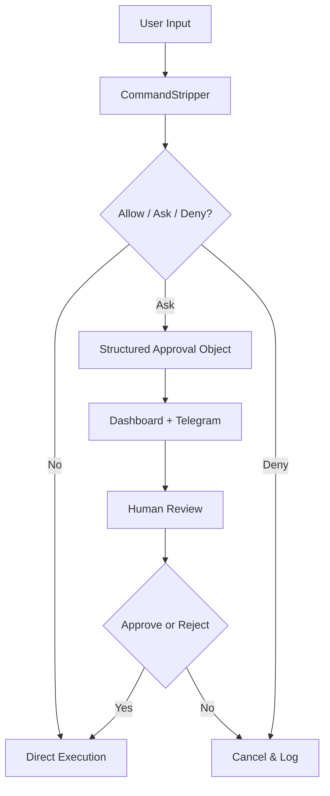

# SafeShell and AJA Approval Safety

SafeShell is the command safety layer inside AgentX Core. AJA uses it to keep shell execution explainable, auditable, and human-approved when risk is present.

## 🧱 The Architecture

## 🛠️ Features

1.  **Noise Removal**: Uses the `stripper.py` logic to "see through" `sudo`, `timeout`, and environment variables to find the true intent of the command.
2.  **Layered Risk Classification**: Commands are classified as **Allow**, **Ask**, or **Deny** using root-binary analysis plus dangerous pattern checks such as shell substitution, network pipes, protected-path writes, and blocked environment variables.
3.  **Human-in-the-Loop**: `Ask` commands are paused as structured approval objects. The user can approve or reject from CLI, dashboard, or Telegram.
4.  **Explainability**: Approval objects include command preview, action type, reason, risk level, rollback path, expiry, requester source, and dry-run summary.
5.  **AI Risk Analysis**: The Python SafeShell/TUI path can still call the **Unified Gateway** (NVIDIA, Groq, etc.) to generate plain-language explanations for risky commands before approval.

## ✅ Current Runtime Behavior

The current `src/tools/bashTool.ts` behavior is:

- **Allow**: Executes the command with sanitized environment variables.
- **Ask**: Returns an approval-required message and writes a structured pending approval for CLI, dashboard, or Telegram review.
- **Deny**: Blocks execution immediately and explains why.

Default production behavior for risky actions is **Ask**. There is no hidden execution path for risky commands.

### Approval Object

Every risky action should be understandable before approval. A pending approval contains:

- `id`
- `commandPreview`
- `actionType`
- `humanReason`
- `riskLevel`
- `rollbackPath`
- `expiresAt`
- `requesterSource`
- `dryRunSummary`
- `reasons`

### Dashboard and Telegram Approval Path

When a risky command is waiting:

1. the runtime or Telegram bridge writes the pending approval into `.agentx/runtime-state.json`
2. `scripts/api_bridge.py` exposes that state to the React dashboard
3. Telegram-originated requests are also sent to the phone as readable approval text
4. dashboard approve/deny actions or Telegram `approve <id>` / `reject <id>` decide the request
5. the command is checked again through `FileGuardian` and `CommandStripper` before execution
6. approval lifecycle entries are appended to `.agentx/approval-audit.jsonl`

This keeps the TypeScript runtime, dashboard, and phone control path aligned with the `Allow / Ask / Deny` model, even though the shell parser is still heuristic rather than a full AST parser.

## 💎 Premium TUI (Terminal User Interface)

For a first-class developer experience, we have provided `tui_shell.py`. This moves beyond the simple REPL and provides a dashboard-like environment.

### TUI Features
- **Neon Dark Theme**: High-contrast, modern aesthetic inspired by Claude's `ink` components.
- **Risk Side-Panel**: A dedicated area that displays AI-generated risk analysis when dangerous binaries are detected.
- **Status Dashboard**: Persistent monitoring of your current AI backbone (NVIDIA, Groq, etc.).
- **Interactive Input**: Batch-processed inputs and scrollable output history.

---
## 🚀 Getting Started

1.  **Launch**: `python scripts/safe_shell.py`
2.  **Configure**: Enter your preferred provider (e.g., `nvidia`) and API key.
3.  **Test**: Try running a "noisy" dangerous command:
    `DEBUG=true sudo rm -rf ./temp_dir`

SafeShell will strip the noise, identify the `rm` command, and ask the AI to explain why deleting a directory with `sudo` might be risky.

---
*Generated via RARV analysis on 2026-04-22.*
