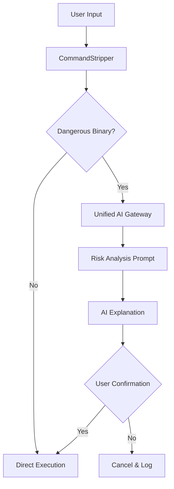

# SafeShell: The Claude-Inspired Secure REPL

SafeShell is the culmination of our research into Claude's architectural spine. It combines **Permission Stripping**, **Multi-Provider AI Analysis**, and **Human-in-the-Loop** confirmation.

## 🧱 The Architecture

## 🛠️ Features

1.  **Noise Removal**: Uses the `stripper.py` logic to "see through" `sudo`, `timeout`, and environment variables to find the true intent of the command.
2.  **Layered Risk Classification**: Commands are classified as **Allow**, **Ask**, or **Deny** using root-binary analysis plus dangerous pattern checks such as shell substitution, network pipes, protected-path writes, and blocked environment variables.
3.  **Human-in-the-Loop**: In the TypeScript runtime, `Ask` commands are paused and stored as pending approvals. The user can execute or cancel them from either the CLI (`/approve`, `/deny`) or the dashboard approval queue.
4.  **AI Risk Analysis**: The Python SafeShell/TUI path can still call the **Unified Gateway** (NVIDIA, Groq, etc.) to generate plain-language explanations for risky commands before confirmation.

## ✅ Current Runtime Behavior

The current `src/tools/bashTool.ts` behavior is:

- **Allow**: Executes the command with sanitized environment variables.
- **Ask**: Returns an approval-required message and waits for approval from the CLI or dashboard.
- **Deny**: Blocks execution immediately and explains why.

### Dashboard Approval Path

When a risky command is waiting:

1. the runtime writes the pending approval into `.agentx/runtime-state.json`
2. `scripts/api_bridge.py` exposes that state to the React dashboard
3. dashboard approve/deny actions call bridge endpoints
4. the bridge runs `src/runtime_actions.ts`, which executes or cancels the pending tool call and updates runtime state

This makes the TypeScript runtime line up with the `Allow / Ask / Deny` model described in the research docs, even though it does not yet use a full shell AST parser.

## 💎 Premium TUI (Terminal User Interface)

For a first-class developer experience, we have provided `tui_shell.py`. This moves beyond the simple REPL and provides a dashboard-like environment.

### TUI Features
- **Neon Dark Theme**: High-contrast, modern aesthetic inspired by Claude's `ink` components.
- **Risk Side-Panel**: A dedicated area that displays AI-generated risk analysis when dangerous binaries are detected.
- **Status Dashboard**: Persistent monitoring of your current AI backbone (NVIDIA, Groq, etc.).
- **Interactive Input**: Batch-processed inputs and scrollable output history.

---
## 🚀 Getting Started

1.  **Launch**: `python scripts/safe_shell.py`
2.  **Configure**: Enter your preferred provider (e.g., `nvidia`) and API key.
3.  **Test**: Try running a "noisy" dangerous command:
    `DEBUG=true sudo rm -rf ./temp_dir`

SafeShell will strip the noise, identify the `rm` command, and ask the AI to explain why deleting a directory with `sudo` might be risky.

---
*Generated via RARV analysis on 2026-04-22.*
