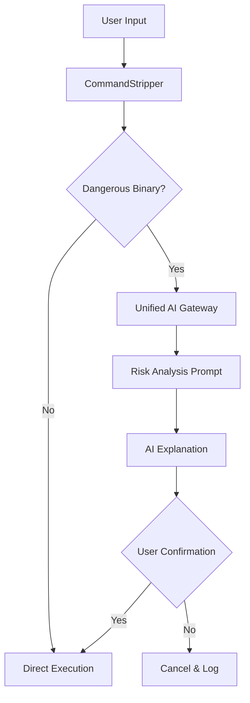

# SafeShell: The Claude-Inspired Secure REPL

SafeShell is the culmination of our research into Claude's architectural spine. It combines **Permission Stripping**, **Multi-Provider AI Analysis**, and **Human-in-the-Loop** confirmation.

## 🧱 The Architecture

## 🛠️ Features

1.  **Noise Removal**: Uses the `stripper.py` logic to "see through" `sudo`, `timeout`, and environment variables to find the true intent of the command.
2.  **AI Risk Analysis**: When a dangerous command (like `rm`, `chmod`, or `curl | bash`) is detected, it automatically calls the **Unified Gateway** (NVIDIA, Groq, etc.) to generate a plain-language explanation of the risks.
3.  **Human-in-the-Loop**: Execution is paused until the user explicitly confirms they understand the risks provided by the AI.

## 💎 Premium TUI (Terminal User Interface)

For a first-class developer experience, we have provided `tui_shell.py`. This moves beyond the simple REPL and provides a dashboard-like environment.

### TUI Features
- **Neon Dark Theme**: High-contrast, modern aesthetic inspired by Claude's `ink` components.
- **Risk Side-Panel**: A dedicated area that displays AI-generated risk analysis when dangerous binaries are detected.
- **Status Dashboard**: Persistent monitoring of your current AI backbone (NVIDIA, Groq, etc.).
- **Interactive Input**: Batch-processed inputs and scrollable output history.

---
## 🚀 Getting Started

1.  **Launch**: `python scripts/safe_shell.py`
2.  **Configure**: Enter your preferred provider (e.g., `nvidia`) and API key.
3.  **Test**: Try running a "noisy" dangerous command:
    `DEBUG=true sudo rm -rf ./temp_dir`

SafeShell will strip the noise, identify the `rm` command, and ask the AI to explain why deleting a directory with `sudo` might be risky.

---
*Generated via RARV analysis on 2026-04-22.*
